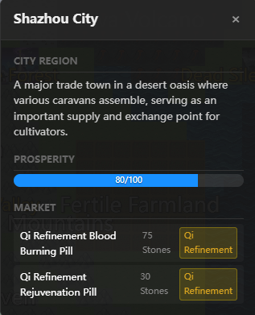
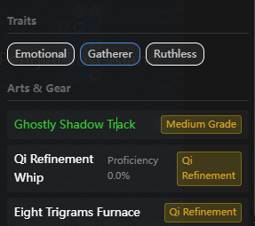
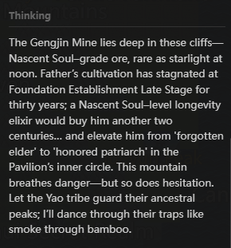
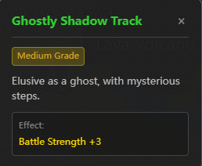
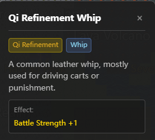

<!-- Language / 语言 -->
<h3 align="center">
  <a href="../../README.md">简体中文</a> · <a href="ZH-TW_README.md">繁體中文</a> · <a href="EN_README.md">English</a> · <a href="VI-VN_README.md">Tiếng Việt</a> · <a href="JA-JP_README.md">日本語</a>
</h3>
<p align="center">— ✦ —</p>

# Cultivation World Simulator


[](https://space.bilibili.com/527346837)

[](https://discord.gg/3Wnjvc7K)
[](../../LICENSE)


<p align="center">
  
</p>

> **Act as the Heavenly Dao and observe a cultivation world simulator driven by rules and AI as it evolves on its own.**
> **Fully LLM-driven NPCs, emergent ensemble storytelling, easy Docker setup, and a solid base for development and modding.**

<p align="center">
  <a href="https://hellogithub.com/repository/4thfever/cultivation-world-simulator" target="_blank">
    
  </a>
  <a href="https://trendshift.io/repositories/20502" target="_blank"></a>
</p>

## 📖 Introduction

This is an **AI-driven cultivation world simulator**.
In the simulator, every cultivator is an independent Agent that can freely observe the environment and make decisions. At the same time, to avoid AI hallucinations and excessive divergence, a complex and flexible cultivation worldview and operating rules are woven in. In a world woven together by rules and AI, cultivator Agents and sect wills compete and cooperate, and new compelling stories emerge. You can quietly watch the world change, witness the rise and fall of sects and the emergence of prodigies, or bring down tribulations and alter minds, subtly intervening in the world's progress.

### ✨ Core Highlights

- 👁️ **Act as the Heavenly Dao**: You are not a cultivator, but the **Heavenly Dao** controlling the world's rules. Observe the myriad forms of life and experience their joys and sorrows.
- 🤖 **Fully AI-Driven**: Every NPC is independently driven by LLMs, with unique personalities, memories, relationships, and behavioral logic. They make decisions based on the current situation, have love and hate, form factions, and even defy the heavens to change their fate.
- 🌏 **Rules as the Cornerstone**: The world runs on a rigorous system of spiritual roots, realms, cultivation methods, personality, sects, elixirs, weapons, martial arts tournaments, auctions, lifespans, and more. AI imagination is constrained within a reasonable and rich cultivation logic framework, ensuring the world is authentic and credible.
- 🦋 **Emergent Storytelling**: Even the developer doesn't know what will happen next. There is no preset script, only world evolution woven from countless causes and effects. Sect wars, righteous vs. demonic conflicts, the fall of geniuses—all are deduced autonomously by the world's logic.

<table border="0">
  <tr>
    <td width="33%" valign="top">
      <h4 align="center">Sect System</h4>
      
      <br/><br/>
      <h4 align="center">City Region</h4>
      
      <br/><br/>
      <h4 align="center">Event History</h4>
      
    </td>
    <td width="33%" valign="top">
      <h4 align="center">Character Panel</h4>
      
      <br/><br/>
      <h4 align="center">Personality & Equipment</h4>
      
      <br/><br/>
      <h4 align="center">Independent Thinking</h4>
      
      <br/><br/>
      <h4 align="center">Nicknames</h4>
      
    </td>
    <td width="33%" valign="top">
      <h4 align="center">Dungeon Exploration</h4>
      
      <br/><br/>
      <h4 align="center">Character Info</h4>
      
      <br/><br/>
      <h4 align="center">Elixirs/Treasures/Weapons</h4>
      
      
      
    </td>
  </tr>
</table>

## 🚀 Quick Start

### Recommended Path

- **Want to modify code or debug**: Use the source setup and prepare Python `3.10+`, Node.js `18+`, and an available model service.
- **Just want to play**: Prefer Docker for one-click deployment.

### First Launch

- Whether you use the source setup or Docker, you need to configure an available model preset on the settings page, such as DeepSeek, MiniMax, or Ollama, before starting a new game.
- In development mode, the frontend page usually opens automatically. If it does not, use the frontend URL shown in the startup logs.

### Option 1: Source Code Deployment (Development Mode, Recommended)

Suitable for developers who need to modify code or debug.

1. **Install Dependencies and Start**
   ```bash
   # 1. Install backend dependencies
   pip install -r requirements.txt

   # 2. Install frontend dependencies (Node.js required)
   cd web && npm install && cd ..

   # 3. Start service (Automatically pulls up frontend and backend)
   python src/server/main.py --dev
   ```

2. **Configure the Model**
   Choose a model preset on the frontend settings page, such as DeepSeek, MiniMax, or Ollama, and then start a new game. The configuration is saved automatically in the user data directory.

3. **Open the Frontend**
   Development mode starts the frontend dev server automatically. Open the frontend URL shown in the startup logs, which is usually `http://localhost:5173`.

### Option 2: Docker One-Click Deployment (Untested)

No environment configuration needed, just run:

```bash
git clone https://github.com/4thfever/cultivation-world-simulator.git
cd cultivation-world-simulator
docker-compose up -d --build
```

Open the frontend: `http://localhost:8123`

The backend container persists user data through `CWS_DATA_DIR=/data`, including settings, secrets, saves, and logs. By default this is mapped to host path `./docker-data`, so data remains after `docker compose down` followed by `up`.

<details>
<summary><b>LAN / Mobile Access Configuration (Click to expand)</b></summary>

> ⚠️ Mobile UI is not fully adapted yet, for early access only.

1. **Backend Config**: Prefer starting the backend with an environment variable, for example in PowerShell: `$env:SERVER_HOST='0.0.0.0'; python src/server/main.py --dev`. If you need to change the default value, edit the read-only config `static/config.yml` and set `system.host`.
2. **Frontend Config**: Modify `web/vite.config.ts`, add `host: '0.0.0.0'` in the server block.
3. **Access Method**: Ensure phone and computer are under the same WiFi, access `http://<Computer-LAN-IP>:5173`.

</details>

<details>
<summary><b>External API / Agent Integration (Click to expand)</b></summary>

This section is for external agent / Claw integration, automation scripts, or gameplay loops such as "observe -> decide -> intervene -> observe again."

For integration, build directly around the stable namespaces:

- Read-only queries: `/api/v1/query/*`
- Controlled mutations: `/api/v1/command/*`

Common starting endpoints:

- `GET /api/v1/query/runtime/status`
- `GET /api/v1/query/world/state`
- `GET /api/v1/query/events`
- `GET /api/v1/query/detail?type=avatar|region|sect&id=<target_id>`
- `POST /api/v1/command/game/start`
- `POST /api/v1/command/avatar/*`
- `POST /api/v1/command/world/*`

A minimal integration flow is usually:

1. Call `GET /api/v1/query/runtime/status` to check current runtime state.
2. If the game is not initialized, call `POST /api/v1/command/game/start`.
3. Pull world snapshots and target information via `world/state`, `events`, and `detail`.
4. Execute one intervention via a `command`.
5. Re-run `query` calls after each intervention; do not infer results from local cache.

Successful responses usually return:

```json
{
  "ok": true,
  "data": {}
}
```

On failure, structured errors are returned. Read `detail.code` and `detail.message` for programmatic branching.

Additional notes:

- App settings are still managed via `/api/settings*` and `/api/settings/llm*`; they are the source of truth for settings and not part of the external control compatibility layer.
- For the complete API list, layering design, and extension conventions, see `docs/specs/external-control-api.md`.

</details>

### 💭 Why make this?
The worlds in cultivation novels are fascinating, but readers can only ever observe a corner of them.

Cultivation games are either completely scripted or rely on simple state machines designed by humans, often resulting in forced and unintelligent behaviors.

With the advent of Large Language Models, the goal of making "every character alive" seems reachable.

I hope to create a pure, joyful, direct, and living sense of immersion in a cultivation world. Not a pure marketing tool for some game company, nor pure research like Stanford Town, but an actual world that provides players with real immersion.

## 📞 Contact
If you have any questions or suggestions about the project, feel free to submit an Issue.

- **Bilibili**: [Subscribe](https://space.bilibili.com/527346837)
- **QQ Group**: `1071821688` (Verification answer: 肥桥今天吃什么)
- **Discord**: [Join Community](https://discord.gg/3Wnjvc7K)

---

## ⭐ Star History

If you find this project interesting, please give us a Star ⭐! This will inspire us to continuously improve and add new features.

<div align="center">
  <a href="https://star-history.com/#4thfever/cultivation-world-simulator&Date">
    
  </a>
</div>

## Plugins

Thanks to contributors for building plugins for this repository.

- [cultivation-world-simulator-api-skill](https://github.com/RealityError/cultivation-world-simulator-api-skill)
- [cultivation-world-simulator-android](https://github.com/RealityError/cultivation-world-simulator-android)

## 👥 Contributors

<a href="https://github.com/4thfever/cultivation-world-simulator/graphs/contributors">
  
</a>

For more contribution details, please see [CONTRIBUTORS.md](../../CONTRIBUTORS.md).

## 📋 Feature Development Progress

### 🏗️ Foundation System
- ✅ Basic world map, time, event system
- ✅ Diverse terrain types (plain, mountain, forest, desert, water, etc.)
- ✅ Web frontend-based display interface
- ✅ Basic simulator framework
- ✅ Configuration files
- ✅ Release one-click playable exe
- ✅ Menu bar & Save & Load
- ✅ Flexible custom LLM interface
- ✅ Support Mac OS
- ✅ Multi-language localization
- ✅ Start game page
- ✅ BGM & Sound effects
- ✅ Player editing
- [ ] Personal mode (play as a character)

### 🗺️ World System
- ✅ Basic tile system
- ✅ Basic region, cultivation region, city region, sect region
- ✅ Same-tile NPC interaction
- ✅ Qi distribution and yield design
- ✅ World events
- ✅ Heaven, Earth, and Mortal Rankings
- [ ] Larger and more beautiful maps & Random maps

### 👤 Character System
- ✅ Character basic attributes system
- ✅ Cultivation realms system
- ✅ Spiritual roots system
- ✅ Basic movement actions
- ✅ Character traits and personality
- ✅ Realm breakthrough mechanism
- ✅ Interpersonal relationships
- ✅ Character interaction range
- ✅ Character Effects system: buffs/debuffs
- ✅ Character techniques
- ✅ Character weapons & auxiliary equipment
- ✅ Goldfinger system
- ✅ Elixirs
- ✅ Character short and long-term memory
- ✅ Character's short and long-term goals, supporting player active setting
- ✅ Character nicknames
- ✅ Life Skills
  - ✅ Harvesting, Hunting, Mining, Planting
  - ✅ Casting
  - ✅ Refining
- ✅ Mortals
- [ ] Deity Transformation Realm

### 🏛️ Organizations
- ✅ Sects
  - ✅ Settings, techniques, healing, base, conduct style, tasks
  - ✅ Sect special actions: Hehuan Sect (dual cultivation), Hundred Beasts Sect (beast taming), etc.
  - ✅ Sect tiers
  - ✅ Orthodoxy
- [ ] Clans
- ✅ Imperial Court
- ✅ Organization Will AI
- ✅ Organization tasks, resources, functions
- ✅ Inter-organization relations network

### ⚡ Action System
- ✅ Basic movement actions
- ✅ Action execution framework
- ✅ Defined actions with explicit rules
- ✅ Long-duration action execution and settlement system
  - ✅ Support multi-month sustained actions (e.g., cultivation, breakthrough, playing, etc.)
  - ✅ Automatic settlement mechanism upon action completion
- ✅ Multiplayer actions: action initiation and response
- ✅ LLM actions affecting interpersonal relationships
- ✅ Systematic action registration and runtime logic

### 🎭 Event System
- ✅ Heaven and earth Qi fluctuations
- ✅ Large multiplayer events:
  - ✅ Auctions
  - ✅ Hidden domain exploration
  - ✅ World Martial Arts Tournament
  - ✅ Sect preaching convention
- [ ] Sudden events
  - [ ] Treasure/cave emergence
  - [ ] Natural disasters

### ⚔️ Combat System
- ✅ Advantages and counters relationships
- ✅ Win rate calculation system

### 🎒 Item System
- ✅ Basic items, spirit stones framework
- ✅ Item trading mechanism

### 🌿 Ecosystem
- ✅ Animals and plants
- ✅ Hunting, gathering, materials system
- [ ] Demonic beasts

### 🤖 AI Enhancement System
- ✅ LLM interface integration
- ✅ Character AI system (Rules AI + LLM AI)
- ✅ Coroutine decision-making mechanism, asynchronous running, multi-threaded acceleration of AI decisions
- ✅ Long-term planning and goal-oriented behavior
- ✅ Sudden action response system (immediate reaction to external stimuli)
- ✅ LLM-driven NPC dialogue, thinking, and interaction
- ✅ LLM generated short story fragments
- ✅ Separately connect max/flash models based on task requirements
- ✅ Micro-theaters
  - ✅ Combat micro-theaters
  - ✅ Dialogue micro-theaters
  - ✅ Different text styles for micro-theaters
- ✅ One-time choices (e.g., whether to switch techniques)

### 🏛️ World Lore System
- ✅ Inject basic world knowledge
- ✅ Dynamic generation of techniques, equipment, sects, and regional information based on user input history

### ✨ Specials
- ✅ Fortuitous encounters
- ✅ Heavenly Tribulations & Heart Devils
- [ ] Opportunities & Karma
- [ ] Divination & Prophecies
- [ ] Character Secrets & Conspiracies
- [ ] Ascension to Upper Realm
- [ ] Formations
- [ ] World Secrets & World Laws
- [ ] Gu
- [ ] World-ending Crisis
- [ ] Found a sect / Establish a clan / Become emperor

### 🔭 Long-term Prospects
- [ ] Novelization & imagery & video of history/events
- [ ] Skill agentification, cultivators autonomously planning, analyzing, calling tools, and making decisions
- [ ] Integrate your own Claw into the cultivation world
