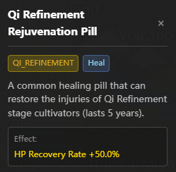

<!-- Language / 言語 -->
<h3 align="center">
  <a href="../../README.md">简体中文</a> · <a href="ZH-TW_README.md">繁體中文</a> · <a href="EN_README.md">English</a> · <a href="VI-VN_README.md">Tiếng Việt</a> · <a href="JA-JP_README.md">日本語</a>
</h3>
<p align="center">— ✦ —</p>

# 修仙世界シミュレーター


[](https://space.bilibili.com/527346837)

[](https://discord.gg/3Wnjvc7K)
[](../../LICENSE)


<p align="center">
  
</p>

> **あなたは「天道」として、ルール体系と AI によって駆動される修仙世界が自律的に変化していく様子を見守ります。**
> **全 NPC が LLM 駆動、群像的な物語が自然発生し、Docker で手軽に動かせて、改造や二次創作の土台としても扱いやすい作品です。**

<p align="center">
  <a href="https://hellogithub.com/repository/4thfever/cultivation-world-simulator" target="_blank">
    
  </a>
  <a href="https://trendshift.io/repositories/20502" target="_blank"></a>
</p>

## 📖 紹介

これは **AI 駆動の修仙世界シミュレーター** です。  
このシミュレーターでは、すべての修士が独立した Agent として存在し、環境を観察し、自ら判断して行動します。同時に、AI の暴走や幻覚を防ぐため、複雑かつ柔軟な修仙世界観と運行ルールが織り込まれています。ルールと AI が共に織り上げる世界では、修士たちと宗門の意思が競い合い、ときに協力し、新たな物語が絶えず生まれます。宗門の興亡や天才の台頭を静かに見届けることも、天劫を下したり心境へ干渉したりして世界の流れにそっと手を加えることもできます。

### ✨ 主な魅力

- 👁️ **「天道」を演じる**: あなたは一人の修士ではなく、世界の法則を司る **天道** です。万象を見渡し、衆生の悲喜こもごもを味わえます。
- 🤖 **完全 AI 駆動**: すべての NPC が LLM によって独立駆動され、固有の性格、記憶、人間関係、行動原理を持ちます。局面に応じて判断し、愛憎を抱き、勢力を結び、時には天命に逆らいます。
- 🌏 **厳密な世界ルール**: 霊根、境界、功法、性格、宗門、丹薬、兵器、武道会、競売会、寿元などが組み合わさって世界が動きます。AI の想像力は、豊かでありながら破綻しない修仙ロジックの中に収められています。
- 🦋 **涌現する物語**: 次の瞬間に何が起きるかは、開発者にも分かりません。あらかじめ決まった脚本ではなく、無数の因果が絡み合って世界が変化していきます。

<table border="0">
  <tr>
    <td width="33%" valign="top">
      <h4 align="center">宗門システム</h4>
      
      <br/><br/>
      <h4 align="center">都市区域</h4>
      
      <br/><br/>
      <h4 align="center">出来事履歴</h4>
      
    </td>
    <td width="33%" valign="top">
      <h4 align="center">キャラクターパネル</h4>
      
      <br/><br/>
      <h4 align="center">性格と装備</h4>
      
      <br/><br/>
      <h4 align="center">自律思考</h4>
      
      <br/><br/>
      <h4 align="center">綽号</h4>
      
    </td>
    <td width="33%" valign="top">
      <h4 align="center">洞府探索</h4>
      
      <br/><br/>
      <h4 align="center">キャラクター情報</h4>
      
      <br/><br/>
      <h4 align="center">丹薬 / 法宝 / 武器</h4>
      
      
      
    </td>
  </tr>
</table>

## 🚀 クイックスタート

### おすすめの始め方

- **コードを改造したい / デバッグしたい**: ソースコードで起動し、Python `3.10+`、Node.js `18+`、利用可能なモデルサービスを用意してください。
- **まず遊びたい**: Docker によるワンクリック起動がおすすめです。

### 初回起動時の注意

- ソース起動でも Docker 起動でも、新しいゲームを始める前に設定ページで利用可能なモデルプリセットを選ぶ必要があります。DeepSeek、MiniMax、Ollama などが使えます。
- 開発モードでは通常フロントエンドページが自動で開きます。開かない場合は、起動ログに表示された URL にアクセスしてください。

### 方法 1: ソースコード起動（開発向け・推奨）

コードを触ったりデバッグしたりしたい人向けです。

1. **依存関係をインストールして起動**
   ```bash
   # 1. バックエンド依存関係をインストール
   pip install -r requirements.txt

   # 2. フロントエンド依存関係をインストール（Node.js が必要）
   cd web && npm install && cd ..

   # 3. サービス起動（フロントエンドとバックエンドを自動起動）
   python src/server/main.py --dev
   ```

2. **モデルを設定**
   フロントエンドの設定画面で DeepSeek、MiniMax、Ollama などのモデルプリセットを選び、新しいゲームを開始してください。設定はユーザーデータディレクトリに自動保存されます。

3. **フロントエンドへアクセス**
   開発モードではフロントエンドの dev server が自動で立ち上がります。通常は `http://localhost:5173` ですが、実際には起動ログに表示された URL を参照してください。

### 方法 2: Docker ワンクリック起動（未検証）

環境構築をせず、そのまま起動できます。

```bash
git clone https://github.com/4thfever/cultivation-world-simulator.git
cd cultivation-world-simulator
docker-compose up -d --build
```

フロントエンド URL: `http://localhost:8123`

バックエンドコンテナは `CWS_DATA_DIR=/data` を通じて、設定、秘密鍵、セーブデータ、ログなどのユーザーデータを永続化します。デフォルトではホスト側の `./docker-data` にマウントされているため、`docker compose down` 後に再度 `up` してもデータは保持されます。
Docker 構成では `PostgreSQL` も起動し、オンライン world room や commerce の実行時状態を永続化します。データベースファイルはデフォルトでホスト側の `./docker-data/postgres` に保存されます。

<details>
<summary><b>LAN / モバイルアクセス設定（クリックで展開）</b></summary>

> ⚠️ モバイル UI はまだ完全対応ではありません。現状は試験的な利用向けです。

1. **バックエンド設定**: たとえば PowerShell なら `$env:SERVER_HOST='0.0.0.0'; python src/server/main.py --dev` のように環境変数で起動するのがおすすめです。既定値を変えたい場合は、読み取り専用設定 `static/config.yml` の `system.host` を編集してください。
2. **フロントエンド設定**: `web/vite.config.ts` を開き、`server` ブロックに `host: '0.0.0.0'` を追加してください。
3. **アクセス方法**: PC とスマホを同じ Wi-Fi に接続し、`http://<PCのLAN IP>:5173` にアクセスしてください。

</details>

<details>
<summary><b>外部 API / Agent 連携（クリックで展開）</b></summary>

このセクションは、外部 agent / Claw 連携、自動化スクリプト、または「観測 -> 判断 -> 介入 -> 再観測」のループ運用に向いています。

連携時は、安定した名前空間を中心に実装することを推奨します：

- 読み取り専用クエリ：`/api/v1/query/*`
- 制御付き書き込み：`/api/v1/command/*`

よく使う起点 API：

- `GET /api/v1/query/runtime/status`
- `GET /api/v1/query/world/state`
- `GET /api/v1/query/events`
- `GET /api/v1/query/detail?type=avatar|region|sect&id=<target_id>`
- `POST /api/v1/command/game/start`
- `POST /api/v1/command/avatar/*`
- `POST /api/v1/command/world/*`

最小構成の導入フローは通常次のとおりです：

1. まず `GET /api/v1/query/runtime/status` で現在の実行状態を確認する。
2. 未開始なら `POST /api/v1/command/game/start` で初期化する。
3. `world/state`、`events`、`detail` で世界スナップショットと対象情報を取得する。
4. 方針に応じて 1 つの `command` を実行して介入する。
5. 介入後は必ず再度 `query` し、ローカルキャッシュで結果を推測しない。

成功時は通常、次の形式で返ります：

```json
{
  "ok": true,
  "data": {}
}
```

失敗時は構造化エラーが返ります。分岐処理には `detail.code` と `detail.message` を利用してください。

補足：

- アプリ設定は引き続き `/api/settings*` と `/api/settings/llm*` で管理します。これらは設定の真源であり、外部制御互換レイヤーには含まれません。
- API 一覧の全体、分層設計、拡張規約は `docs/specs/external-control-api.md` を参照してください。

</details>

### 💭 なぜこの作品を作ったのか
修仙小説の世界は魅力的ですが、読者が見られるのはそのごく一部だけです。  
修仙ゲームは、完全にスクリプト化されているか、人間が書いた単純な状態機械に依存していることが多く、不自然で賢くない挙動になりがちです。  
大規模言語モデルの登場によって、「すべてのキャラクターが生きている」世界は、ようやく手の届く目標になりました。  
この作品では、宣伝のためだけの器でも、純研究でもなく、プレイヤーが本当に没入できる、純粋で、生きていて、楽しい修仙世界を作りたいと考えています。

## 📞 連絡先
質問や提案があれば、Issue を送ってください。

- **Bilibili**: [フォローする](https://space.bilibili.com/527346837)
- **QQ Group**: `1071821688`（認証回答: 肥桥今天吃什么）
- **Discord**: [コミュニティに参加](https://discord.gg/3Wnjvc7K)

---

## ⭐ Star History

このプロジェクトが面白いと感じたら、ぜひ Star ⭐ をお願いします。継続的な改善と新機能開発の励みになります。

<div align="center">
  <a href="https://star-history.com/#4thfever/cultivation-world-simulator&Date">
    
  </a>
</div>

## プラグイン

本リポジトリ向けプラグインを提供してくださったコントリビューターの皆さまに感謝します。

- [cultivation-world-simulator-api-skill](https://github.com/RealityError/cultivation-world-simulator-api-skill)
- [cultivation-world-simulator-android](https://github.com/RealityError/cultivation-world-simulator-android)

## 👥 Contributors

<a href="https://github.com/4thfever/cultivation-world-simulator/graphs/contributors">
  
</a>

詳細は [CONTRIBUTORS.md](../../CONTRIBUTORS.md) を参照してください。

## 📋 開発進捗

### 🏗️ 基盤システム
- ✅ 基本世界マップ、時間、イベントシステム
- ✅ 多様な地形タイプ（平原、山脈、森林、砂漠、水域など）
- ✅ Web フロントエンド表示
- ✅ 基本シミュレーター基盤
- ✅ 設定ファイル
- ✅ ワンクリック実行可能な release exe
- ✅ メニューバー / セーブ / ロード
- ✅ 柔軟な LLM 接続
- ✅ Mac OS 対応
- ✅ 多言語ローカライズ
- ✅ ゲーム開始ページ
- ✅ BGM / 効果音
- ✅ プレイヤー編集
- [ ] 個人モード（キャラクターとして遊ぶ）

### 🗺️ 世界システム
- ✅ 基本タイルシステム
- ✅ 基本区域、修行区域、都市区域、宗門区域
- ✅ 同一タイル上の NPC 交流
- ✅ 霊気分布と産出設計
- ✅ 世界イベント
- ✅ 天地人榜
- [ ] より大きく美しいマップ / ランダムマップ

### 👤 キャラクターシステム
- ✅ 基礎属性システム
- ✅ 修行境界システム
- ✅ 霊根システム
- ✅ 基本移動行動
- ✅ 特質と性格
- ✅ 境界突破機構
- ✅ 人間関係
- ✅ 交流範囲
- ✅ Effects システム（バフ / デバフ）
- ✅ 功法
- ✅ 武器と補助装備
- ✅ ゴールドフィンガー・システム
- ✅ 丹薬
- ✅ 長期 / 短期記憶
- ✅ 長期 / 短期目標（プレイヤー設定対応）
- ✅ 綽号
- ✅ 生活技能
  - ✅ 採集、狩猟、採鉱、耕作
  - ✅ 鋳造
  - ✅ 炼丹
- ✅ 凡人
- [ ] 化神境界

### 🏛️ 組織
- ✅ 宗門
  - ✅ 設定、功法、療傷、本拠地、行動様式、任務
  - ✅ 宗門専用行動: 合歓宗（双修）、百獣宗（御獣）など
  - ✅ 宗門等階
  - ✅ 道統
- [ ] 世家
- ✅ 朝廷
- ✅ 組織意志 AI
- ✅ 組織任務、資源、機能
- ✅ 組織間関係ネットワーク

### ⚡ 行動システム
- ✅ 基本移動行動
- ✅ 行動実行フレームワーク
- ✅ 明確なルールを持つ定義済み行動
- ✅ 長時間行動の実行と決算システム
  - ✅ 数か月継続する行動（修行、突破、遊興など）に対応
  - ✅ 行動完了時の自動決算
- ✅ 複数人行動: 行動開始と応答
- ✅ 人間関係へ影響する LLM 行動
- ✅ 体系的な行動登録と実行ロジック

### 🎭 イベントシステム
- ✅ 天地霊気の変動
- ✅ 大規模多人イベント:
  - ✅ 競売会
  - ✅ 秘境探索
  - ✅ 天下武道会
  - ✅ 宗門伝道大会
- [ ] 突発イベント
  - [ ] 宝物 / 洞府出世
  - [ ] 天災

### ⚔️ 戦闘システム
- ✅ 有利不利の相性関係
- ✅ 勝率計算システム

### 🎒 アイテムシステム
- ✅ 基本アイテムと霊石フレームワーク
- ✅ アイテム取引機構

### 🌿 生態系
- ✅ 動植物
- ✅ 狩猟、採集、素材システム
- [ ] 魔獣

### 🤖 AI 強化システム
- ✅ LLM 連携
- ✅ キャラクター AI（ルール AI + LLM AI）
- ✅ コルーチン化した意思決定、非同期実行、マルチスレッド高速化
- ✅ 長期計画と目標志向行動
- ✅ 突発行動応答システム（外部刺激への即時反応）
- ✅ LLM 駆動の NPC 会話、思考、交流
- ✅ LLM 生成の短編イベント
- ✅ タスクに応じた max / flash モデルの使い分け
- ✅ 小劇場
  - ✅ 戦闘小劇場
  - ✅ 会話小劇場
  - ✅ 文体違いの小劇場
- ✅ 一回限りの選択（例: 功法を切り替えるか）

### 🏛️ 世界背景システム
- ✅ 基本世界知識の注入
- ✅ ユーザー入力履歴にもとづく、功法・装備・宗門・地域情報の動的生成

### ✨ 特殊要素
- ✅ 奇遇
- ✅ 天劫 & 心魔
- [ ] 機縁 & 因果
- [ ] 占卜 & 予言
- [ ] キャラクターの秘密 & 陰謀
- [ ] 上界飛昇
- [ ] 陣法
- [ ] 世界の秘密 & 世界法則
- [ ] 蠱
- [ ] 滅世の危機
- [ ] 開宗立派 / 自立世家 / 皇帝即位

### 🔭 長期展望
- [ ] 歴史 / 出来事の小説化・画像化・動画化
- [ ] Skill の agent 化、修士自身による計画・分析・ツール利用・意思決定
- [ ] 自分の Claw を修仙世界へ組み込む
