<!-- Ngôn ngữ / Language -->
<h3 align="center">
  <a href="../../README.md">简体中文</a> · <a href="ZH-TW_README.md">繁體中文</a> · <a href="EN_README.md">English</a> · <a href="VI-VN_README.md">Tiếng Việt</a> · <a href="JA-JP_README.md">日本語</a>
</h3>
<p align="center">— ✦ —</p>

# Mô Phỏng Thế Giới Tu Tiên (Cultivation World Simulator)


[](https://space.bilibili.com/527346837)

[](https://discord.gg/3Wnjvc7K)
[](../../LICENSE)


<p align="center">
  
</p>

> **Bạn sẽ đóng vai Thiên Đạo, quan sát trình mô phỏng thế giới tu tiên do quy tắc và AI cùng vận hành tự mình diễn hóa.**
> **Toàn bộ nhân vật đều do LLM dẫn động, cốt truyện quần tượng nảy sinh tự nhiên, hỗ trợ Docker để khởi động nhanh, đồng thời cũng phù hợp cho phát triển mã nguồn và modding.**

<p align="center">
  <a href="https://hellogithub.com/repository/4thfever/cultivation-world-simulator" target="_blank">
    
  </a>
  <a href="https://trendshift.io/repositories/20502" target="_blank"></a>
</p>

## 📖 Giới Thiệu

Đây là một **trình mô phỏng thế giới tu tiên do AI dẫn động**.
Trong trình mô phỏng, mỗi tu sĩ đều là một Agent độc lập, có thể tự do quan sát môi trường và đưa ra quyết định. Đồng thời, để tránh ảo giác và phát tán quá mức của AI, đã đưa vào thế giới quan tu tiên phức tạp linh hoạt cùng quy tắc vận hành. Trong thế giới được dệt nên bởi quy tắc và AI, các Agent tu sĩ và ý chí tông môn vừa cạnh tranh vừa hợp tác, cốt truyện mới không ngừng nảy sinh. Bạn có thể lặng lẽ nhìn thời cuộc đổi thay, chứng kiến sự hưng suy của tông môn và sự quật khởi của thiên kiêu, hoặc giáng thiên kiếp, tác động tâm thần, khẽ can dự vào tiến trình của thế giới.

### ✨ Điểm Nổi Bật

- 👁️ **Vào vai Thiên Đạo**: Bạn không phải một tu sĩ, mà là **Thiên Đạo** nắm giữ quy tắc vận hành của thế giới. Quan sát muôn hình muôn vẻ của chúng sinh, cảm nhận bi hoan ly hợp.
- 🤖 **Toàn bộ nhân vật đều do AI dẫn động**: Mỗi NPC đều được LLM điều khiển độc lập, có tính cách, ký ức, quan hệ xã hội và logic hành vi riêng. Họ sẽ tự đưa ra quyết định theo cục diện hiện tại, biết yêu hận, biết kết bè phái, thậm chí còn có thể nghịch thiên cải mệnh.
- 🌏 **Lấy quy tắc làm nền móng**: Thế giới vận hành bằng một hệ thống nghiêm cẩn gồm linh căn, cảnh giới, công pháp, tính cách, tông môn, đan dược, binh khí, võ đạo hội, đấu giá hội, thọ nguyên và nhiều yếu tố khác. Sức tưởng tượng của AI được đặt trong khung logic tu tiên hợp lý và phong phú, đảm bảo thế giới chân thực đáng tin.
- 🦋 **Tự sự nảy sinh tự nhiên**: Ngay cả tác giả cũng không biết khoảnh khắc tiếp theo sẽ xảy ra chuyện gì. Không có kịch bản định sẵn, chỉ có thế giới tự mình diễn hóa từ vô số nhân quả giao chồng. Đại chiến tông môn, chính ma tranh phong, thiên kiêu vẫn lạc, tất cả đều do logic thế giới tự suy diễn.

<table border="0">
  <tr>
    <td width="33%" valign="top">
      <h4 align="center">Hệ Thống Tông Môn</h4>
      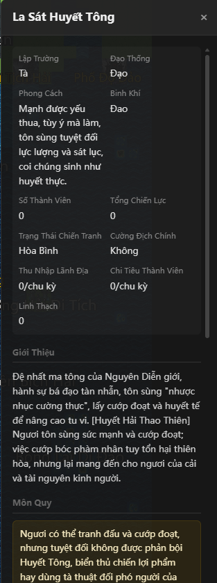
      <br/><br/>
      <h4 align="center">Khu Vực Thành Thị</h4>
      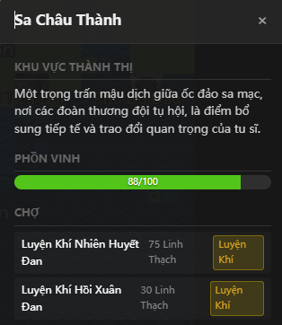
      <br/><br/>
      <h4 align="center">Lịch Sử Sự Kiện</h4>
      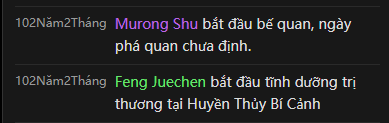
    </td>
    <td width="33%" valign="top">
      <h4 align="center">Bảng Nhân Vật</h4>
      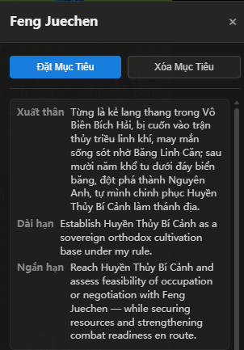
      <br/><br/>
      <h4 align="center">Tính Cách Và Trang Bị</h4>
      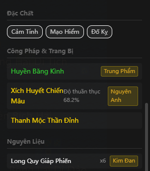
      <br/><br/>
      <h4 align="center">Tự Chủ Suy Tư</h4>
      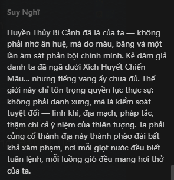
      <br/><br/>
      <h4 align="center">Biệt Hiệu Giang Hồ</h4>
      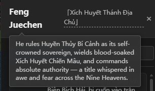
    </td>
    <td width="33%" valign="top">
      <h4 align="center">Thám Hiểm Bí Cảnh</h4>
      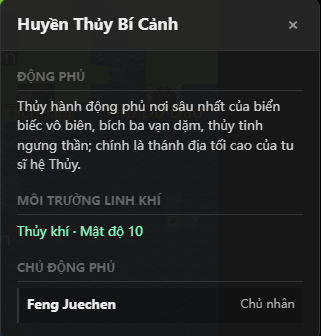
      <br/><br/>
      <h4 align="center">Thông Tin Nhân Vật</h4>
      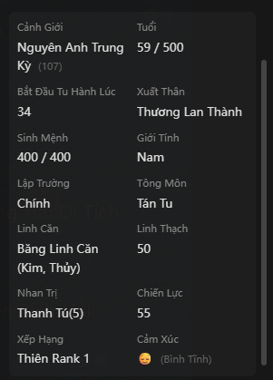
      <br/><br/>
      <h4 align="center">Đan Dược / Pháp Bảo / Binh Khí</h4>
      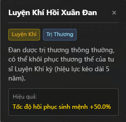
      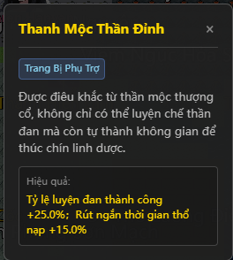
      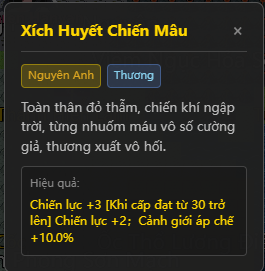
    </td>
  </tr>
</table>

## 🚀 Khởi Đầu Nhanh

### Cách Được Khuyến Nghị

- **Nếu muốn sửa code hoặc debug**: Dùng cách chạy từ mã nguồn, đồng thời chuẩn bị Python `3.10+`, Node.js `18+` và một dịch vụ mô hình khả dụng.
- **Nếu chỉ muốn trải nghiệm ngay**: Ưu tiên dùng Docker để triển khai một lệnh.

### Lưu Ý Khi Khởi Chạy Lần Đầu

- Dù chạy từ mã nguồn hay Docker, sau khi vào game lần đầu bạn vẫn cần vào trang cài đặt để cấu hình một preset mô hình khả dụng, như DeepSeek, MiniMax hoặc Ollama, rồi mới bắt đầu ván mới.
- Ở chế độ phát triển, frontend thường sẽ tự mở. Nếu không tự mở, hãy truy cập vào địa chỉ frontend xuất hiện trong log khởi động.

### Cách 1: Chạy Từ Mã Nguồn (Chế Độ Phát Triển, Khuyến Nghị)

Phù hợp cho nhà phát triển cần sửa code hoặc debug.

1. **Cài đặt phụ thuộc và khởi động**
   ```bash
   # 1. Cài phụ thuộc backend
   pip install -r requirements.txt

   # 2. Cài phụ thuộc frontend (cần Node.js)
   cd web && npm install && cd ..

   # 3. Khởi động dịch vụ (tự kéo cả frontend lẫn backend)
   python src/server/main.py --dev
   ```

2. **Cấu hình mô hình**
   Trên trang cài đặt của frontend, chọn một preset mô hình như DeepSeek, MiniMax hoặc Ollama, sau đó bắt đầu ván chơi mới. Cấu hình sẽ tự động được lưu vào thư mục dữ liệu người dùng.

3. **Mở frontend**
   Chế độ phát triển sẽ tự khởi chạy frontend dev server. Hãy mở địa chỉ frontend hiện trong log khởi động, thông thường là `http://localhost:5173`.

### Cách 2: Triển khai Docker một lệnh (chưa thử nghiệm)

Không cần tự cấu hình môi trường, chỉ cần chạy:

```bash
git clone https://github.com/4thfever/cultivation-world-simulator.git
cd cultivation-world-simulator
docker-compose up -d --build
```

Truy cập frontend: `http://localhost:8123`

Backend container dùng `CWS_DATA_DIR=/data` để lưu bền vững dữ liệu người dùng, bao gồm cài đặt, khóa bí mật, save và log. Mặc định đã ánh xạ tới đường dẫn máy chủ `./docker-data`, nên dữ liệu vẫn còn sau khi chạy `docker compose down` rồi `up` lại.

<details>
<summary><b>Cấu hình truy cập qua mạng LAN / điện thoại (nhấn để mở)</b></summary>

> ⚠️ Giao diện di động hiện vẫn chưa được tối ưu hoàn chỉnh, hiện chỉ phù hợp để trải nghiệm sớm.

1. **Cấu hình backend**: Nên khởi động backend bằng biến môi trường. Ví dụ trong PowerShell: `$env:SERVER_HOST='0.0.0.0'; python src/server/main.py --dev`. Nếu muốn chỉnh giá trị mặc định, hãy sửa cấu hình chỉ đọc `static/config.yml` và đặt `system.host`.
2. **Cấu hình frontend**: Sửa `web/vite.config.ts`, thêm `host: '0.0.0.0'` vào khối `server`.
3. **Cách truy cập**: Bảo đảm điện thoại và máy tính cùng ở một mạng WiFi, sau đó truy cập `http://<LAN-IP-cua-may-tinh>:5173`.

</details>

<details>
<summary><b>API bên ngoài / Tích hợp Agent (nhấn để mở)</b></summary>

Phần này phù hợp cho việc tích hợp agent / Claw bên ngoài, script tự động hóa, hoặc cách chơi theo vòng lặp "quan sát -> quyết định -> can thiệp -> quan sát lại".

Nên tích hợp trực tiếp theo namespace ổn định:

- Truy vấn chỉ đọc: `/api/v1/query/*`
- Ghi có kiểm soát: `/api/v1/command/*`

Các endpoint khởi đầu thường dùng:

- `GET /api/v1/query/runtime/status`
- `GET /api/v1/query/world/state`
- `GET /api/v1/query/events`
- `GET /api/v1/query/detail?type=avatar|region|sect&id=<target_id>`
- `POST /api/v1/command/game/start`
- `POST /api/v1/command/avatar/*`
- `POST /api/v1/command/world/*`

Quy trình tích hợp tối thiểu thường là:

1. Gọi `GET /api/v1/query/runtime/status` để kiểm tra trạng thái chạy hiện tại.
2. Nếu ván chưa khởi tạo, gọi `POST /api/v1/command/game/start`.
3. Dùng `world/state`, `events`, `detail` để lấy snapshot thế giới và thông tin mục tiêu.
4. Thực thi một hành động can thiệp qua `command`.
5. Sau can thiệp, gọi lại `query`; không suy đoán kết quả từ cache cục bộ.

Khi thành công, API thường trả về:

```json
{
  "ok": true,
  "data": {}
}
```

Khi thất bại, API trả lỗi có cấu trúc; có thể đọc `detail.code` và `detail.message` để xử lý theo chương trình.

Ghi chú bổ sung:

- Thiết lập ứng dụng vẫn được quản lý qua `/api/settings*` và `/api/settings/llm*`; đây là nguồn sự thật cho cấu hình, không thuộc lớp tương thích điều khiển bên ngoài.
- Danh sách API đầy đủ hơn, thiết kế phân lớp và quy ước mở rộng xem tại `docs/specs/external-control-api.md`.

</details>

### 💭 Vì Sao Làm Dự Án Này?

Thế giới trong truyện tu tiên rất hấp dẫn, nhưng độc giả thường chỉ được nhìn thấy một góc rất nhỏ của nó.

Phần lớn game tu tiên hiện nay hoặc là kịch bản viết sẵn hoàn toàn, hoặc dựa vào những state machine đơn giản do con người thiết kế, nên thường tạo ra cảm giác gượng gạo và kém thông minh.

Sau khi mô hình ngôn ngữ lớn xuất hiện, mục tiêu làm cho "mỗi một nhân vật đều thật sự sống động" dường như đã trở nên khả thi hơn.

Tôi muốn tạo ra một cảm giác nhập vai thuần túy, trực tiếp, sống động và vui vẻ trong một thế giới tu tiên. Không phải công cụ quảng bá thuần túy cho một công ty game nào đó, cũng không chỉ là dự án nghiên cứu như Stanford Town, mà là một thế giới thực sự có thể mang đến cảm giác nhập vai cho người chơi.

## 📞 Liên Hệ

Nếu bạn có bất kỳ câu hỏi hoặc góp ý nào về dự án, cứ tự nhiên mở Issue.

- **Bilibili**: [Theo dõi](https://space.bilibili.com/527346837)
- **QQ Group**: `1071821688` (Câu trả lời xác thực: 肥桥今天吃什么)
- **Discord**: [Tham gia cộng đồng](https://discord.gg/3Wnjvc7K)

---

## ⭐ Star History

Nếu bạn thấy dự án này thú vị, hãy cho chúng tôi một Star ⭐. Điều đó sẽ tiếp thêm động lực để chúng tôi tiếp tục cải thiện và bổ sung tính năng mới.

<div align="center">
  <a href="https://star-history.com/#4thfever/cultivation-world-simulator&Date">
    
  </a>
</div>

## Plugin

Cảm ơn các contributor đã đóng góp plugin cho repo này.

- [cultivation-world-simulator-api-skill](https://github.com/RealityError/cultivation-world-simulator-api-skill)
- [cultivation-world-simulator-android](https://github.com/RealityError/cultivation-world-simulator-android)

## 👥 Contributors

<a href="https://github.com/4thfever/cultivation-world-simulator/graphs/contributors">
  
</a>

Chi tiết đóng góp vui lòng xem [CONTRIBUTORS.md](../../CONTRIBUTORS.md).

## 📋 Tiến Độ Phát Triển Tính Năng

### 🏗️ Hệ Thống Nền Tảng
- ✅ Bản đồ thế giới, thời gian và hệ thống sự kiện cơ bản
- ✅ Đa dạng địa hình (bình nguyên, sơn mạch, rừng rậm, sa mạc, thủy vực...)
- ✅ Giao diện hiển thị trên Web frontend
- ✅ Khung mô phỏng cơ bản
- ✅ Tệp cấu hình
- ✅ Bản exe phát hành chơi ngay chỉ bằng một lần mở
- ✅ Thanh menu, lưu game và đọc save
- ✅ Tùy biến linh hoạt giao diện LLM
- ✅ Hỗ trợ macOS
- ✅ Bản địa hóa đa ngôn ngữ
- ✅ Trang bắt đầu game
- ✅ BGM và hiệu ứng âm thanh
- ✅ Người chơi có thể chỉnh sửa nội dung
- [ ] Chế độ cá nhân (nhập vai nhân vật)

### 🗺️ Hệ Thống Thế Giới
- ✅ Hệ thống ô tile cơ bản
- ✅ Khu vực thường, khu tu luyện, khu thành thị, khu tông môn
- ✅ Tương tác NPC trong cùng một ô
- ✅ Thiết kế phân bố và sản xuất linh khí
- ✅ Sự kiện thế giới
- ✅ Thiên bảng, Địa bảng và Nhân bảng
- [ ] Bản đồ lớn hơn, đẹp hơn và hỗ trợ bản đồ ngẫu nhiên

### 👤 Hệ Thống Nhân Vật
- ✅ Hệ thống thuộc tính cơ bản của nhân vật
- ✅ Hệ thống cảnh giới tu luyện
- ✅ Hệ thống linh căn
- ✅ Hành động di chuyển cơ bản
- ✅ Tính cách và đặc chất nhân vật
- ✅ Cơ chế đột phá cảnh giới
- ✅ Quan hệ giữa các nhân vật
- ✅ Phạm vi tương tác của nhân vật
- ✅ Hệ thống Effects cho nhân vật: buff/debuff
- ✅ Công pháp của nhân vật
- ✅ Binh khí và trang bị phụ trợ
- ✅ Hệ thống Goldfinger
- ✅ Đan dược
- ✅ Ký ức ngắn hạn và dài hạn
- ✅ Mục tiêu ngắn hạn và dài hạn, đồng thời cho phép người chơi chủ động đặt mục tiêu
- ✅ Biệt hiệu nhân vật
- ✅ Kỹ năng sinh hoạt
  - ✅ Thu thập, săn bắt, khai khoáng, trồng trọt
  - ✅ Đúc tạo
  - ✅ Luyện đan
- ✅ Phàm nhân
- [ ] Cảnh giới Hóa Thần

### 🏛️ Tổ Chức
- ✅ Tông môn
  - ✅ Thiết lập, công pháp, trị thương, trú địa, phong cách hành sự, nhiệm vụ
  - ✅ Hành động đặc thù của tông môn: Hợp Hoan Tông (song tu), Bách Thú Tông (ngự thú)...
  - ✅ Cấp bậc tông môn
  - ✅ Đạo thống
- [ ] Thế gia
- ✅ Triều đình
- ✅ AI ý chí tổ chức
- ✅ Nhiệm vụ, tài nguyên và chức năng của tổ chức
- ✅ Mạng lưới quan hệ giữa các tổ chức

### ⚡ Hệ Thống Hành Động
- ✅ Hành động di chuyển cơ bản
- ✅ Khung thực thi hành động
- ✅ Những hành động có quy tắc rõ ràng
- ✅ Hệ thống thực thi và kết toán cho hành động dài hạn
  - ✅ Hỗ trợ hành động kéo dài nhiều tháng (như tu luyện, đột phá, vui chơi...)
  - ✅ Tự động kết toán khi hành động hoàn thành
- ✅ Hành động nhiều người: khởi phát và phản hồi
- ✅ Hành động do LLM dẫn động có ảnh hưởng tới quan hệ giữa các nhân vật
- ✅ Logic đăng ký và vận hành hành động theo hệ thống

### 🎭 Hệ Thống Sự Kiện
- ✅ Biến động linh khí thiên địa
- ✅ Đại sự kiện nhiều người:
  - ✅ Đấu giá hội
  - ✅ Thám hiểm bí cảnh
  - ✅ Thiên hạ võ đạo hội
  - ✅ Đại hội truyền đạo tông môn
- [ ] Biến cố đột phát
  - [ ] Bảo vật / động phủ xuất thế
  - [ ] Thiên tai

### ⚔️ Hệ Thống Chiến Đấu
- ✅ Quan hệ tương khắc và ưu thế
- ✅ Hệ thống tính toán xác suất thắng bại

### 🎒 Hệ Thống Vật Phẩm
- ✅ Khung vật phẩm cơ bản và linh thạch
- ✅ Cơ chế giao dịch vật phẩm

### 🌿 Hệ Sinh Thái
- ✅ Động thực vật
- ✅ Săn bắt, thu thập và hệ thống vật liệu
- [ ] Ma thú

### 🤖 Hệ Thống Tăng Cường AI
- ✅ Tích hợp giao diện LLM
- ✅ Hệ thống AI nhân vật (Rule AI + LLM AI)
- ✅ Cơ chế quyết sách coroutine, chạy bất đồng bộ, tăng tốc quyết định AI bằng đa luồng
- ✅ Hành vi quy hoạch dài hạn và định hướng mục tiêu
- ✅ Hệ thống phản ứng hành động đột phát (phản ứng tức thời với kích thích bên ngoài)
- ✅ Đối thoại, suy nghĩ và tương tác NPC do LLM dẫn động
- ✅ LLM sinh các đoạn truyện ngắn
- ✅ Kết nối riêng max/flash model tùy theo nhu cầu nhiệm vụ
- ✅ Tiểu kịch trường
  - ✅ Tiểu kịch trường chiến đấu
  - ✅ Tiểu kịch trường đối thoại
  - ✅ Nhiều phong cách văn bản khác nhau cho tiểu kịch trường
- ✅ Lựa chọn một lần (ví dụ có nên đổi công pháp hay không)

### 🏛️ Hệ Thống Bối Cảnh Thế Giới
- ✅ Tiêm tri thức nền tảng của thế giới
- ✅ Sinh động thông tin công pháp, trang bị, tông môn và khu vực dựa trên lịch sử người dùng nhập vào

### ✨ Đặc Thù
- ✅ Kỳ ngộ
- ✅ Thiên kiếp và tâm ma
- [ ] Cơ duyên và nhân quả
- [ ] Chiêm bốc và sấm vĩ
- [ ] Bí mật nhân vật và âm mưu
- [ ] Phi thăng thượng giới
- [ ] Trận pháp
- [ ] Bí mật thế giới và pháp tắc thế giới
- [ ] Cổ
- [ ] Khủng hoảng diệt thế
- [ ] Tự lập tông môn / tự lập thế gia / trở thành hoàng đế

### 🔭 Triển Vọng Dài Hạn
- [ ] Tiểu thuyết hóa / hình ảnh hóa / video hóa lịch sử và sự kiện
- [ ] Agent hóa kỹ năng, để tu sĩ tự quy hoạch, tự phân tích, tự gọi công cụ và tự quyết sách
- [ ] Tích hợp Claw của chính bạn vào thế giới tu tiên
