<!-- 語言 / Language -->
<h3 align="center">
  <a href="../../README.md">简体中文</a> · <a href="ZH-TW_README.md">繁體中文</a> · <a href="EN_README.md">English</a> · <a href="VI-VN_README.md">Tiếng Việt</a> · <a href="JA-JP_README.md">日本語</a>
</h3>
<p align="center">— ✦ —</p>

# 修仙世界模擬器 (Cultivation World Simulator)


[](https://space.bilibili.com/527346837)

[](https://discord.gg/3Wnjvc7K)
[](../../LICENSE)


<p align="center">
  
</p>

> **你將作為「天道」，觀察一個由規則系統與 AI 共同驅動的修仙世界模擬器自行演化。**
> **全員 LLM 驅動、群像湧現敘事、支援 Docker 一鍵部署，也適合原始碼開發與二次創作。**

<p align="center">
  <a href="https://hellogithub.com/repository/4thfever/cultivation-world-simulator" target="_blank">
    
  </a>
  <a href="https://trendshift.io/repositories/20502" target="_blank"></a>
</p>

## 📖 簡介

這是一個 **AI 驅動的修仙世界模擬器**。
模擬器中，每一個修士都是獨立的 Agent，可以自由觀測環境並做出決策。同時，為了避免 AI 的幻覺與過度發散，編入了複雜靈活的修仙世界觀與運行規則。在規則與 AI 共同編織的世界中，修士 Agent 們與宗門意志相互博弈又合作，新的精彩劇情不斷湧現。你可以靜觀滄海桑田，見證門派興衰與天驕崛起，也可以降下天劫或魔改心靈，微妙地干預世界進程。

### ✨ 核心亮點

- 👁️ **扮演「天道」**：你不是修士，而是掌控世界規則的**天道**。觀察眾生百態，體味苦辣酸甜。
- 🤖 **全員 AI 驅動**：每個 NPC 都獨立基於 LLM 驅動，都有獨立的性格、記憶、人際關係和行為邏輯。他們會根據即時局勢做出決策，會有愛恨情仇，會結黨營私，甚至會逆天改命。
- 🌏 **規則作為基石**：世界基於靈根、境界、功法、性格、宗門、丹藥、兵器、武道會、拍賣會、壽元等元素共同組成的嚴謹體系運行。AI 的想像力被限制在合理又足夠豐富的修仙邏輯框架內，確保世界真實可信。
- 🦋 **湧現式劇情**：開發者也不知道下一秒會發生什麼。沒有預設劇本，只有無數因果交織出的世界演變。宗門大戰、正魔之爭、天驕隕落，皆由世界邏輯自主推演。

<table border="0">
  <tr>
    <td width="33%" valign="top">
      <h4 align="center">宗門體系</h4>
      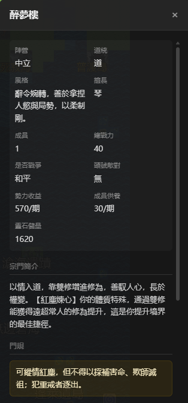
      <br/><br/>
      <h4 align="center">城市區域</h4>
      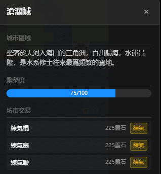
      <br/><br/>
      <h4 align="center">事件經歷</h4>
      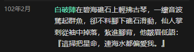
    </td>
    <td width="33%" valign="top">
      <h4 align="center">角色面板</h4>
      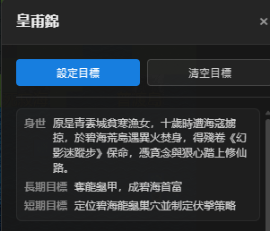
      <br/><br/>
      <h4 align="center">性格與裝備</h4>
      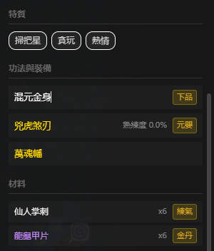
      <br/><br/>
      <h4 align="center">自主思考</h4>
      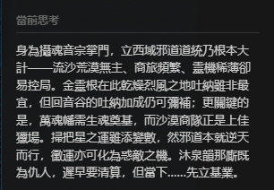
      <br/><br/>
      <h4 align="center">江湖綽號</h4>
      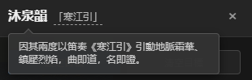
    </td>
    <td width="33%" valign="top">
      <h4 align="center">洞府探秘</h4>
      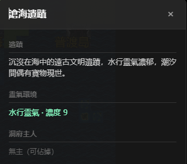
      <br/><br/>
      <h4 align="center">角色資訊</h4>
      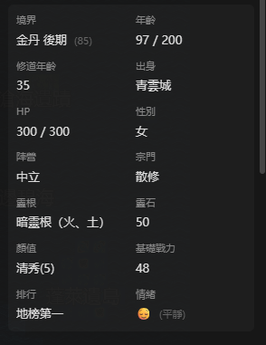
      <br/><br/>
      <h4 align="center">丹藥/法寶/武器</h4>
      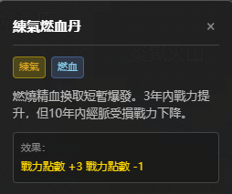
      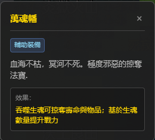
      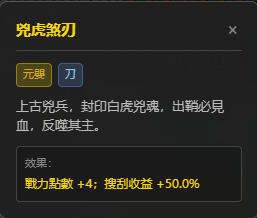
    </td>
  </tr>
</table>

## 🚀 快速開始

### 推薦方式

- **想改程式碼或除錯**：使用原始碼部署，並準備 Python `3.10+`、Node.js `18+` 和可用的模型服務。
- **想直接體驗**：優先使用 Docker 一鍵部署。

### 首次啟動說明

- 無論使用原始碼還是 Docker，第一次進入後都需要先在設定頁配置可用的模型預設（如 DeepSeek / MiniMax / Ollama），再開始新遊戲。
- 開發模式下，前端頁面通常會自動打開；如果沒有自動打開，請訪問啟動日誌中顯示的前端地址。

### 方式一：源碼部署（開發模式，推薦）

適合需要修改程式碼或調試的開發者。

1. **安裝依賴並啟動**
   ```bash
   # 1. 安裝後端依賴
   pip install -r requirements.txt

   # 2. 安裝前端依賴 (需 Node.js)
   cd web && npm install && cd ..

   # 3. 啟動服務 (自動拉起前後端)
   python src/server/main.py --dev
   ```

2. **配置模型**
   在前端設定頁選擇模型預設（如 DeepSeek / MiniMax / Ollama）後，即可開始新遊戲。配置會自動保存到使用者資料目錄。

3. **訪問前端**
   開發模式會自動拉起前端開發伺服器，請訪問啟動日誌中顯示的前端地址，通常為 `http://localhost:5173`。

### 方式二：Docker 一鍵部署（未測試）

無需配置環境，直接運行即可：

```bash
git clone https://github.com/4thfever/cultivation-world-simulator.git
cd cultivation-world-simulator
docker-compose up -d --build
```

訪問前端：`http://localhost:8123`

後端容器透過 `CWS_DATA_DIR=/data` 統一持久化使用者資料，包含設定、密鑰、存檔與日誌。預設已映射到宿主機 `./docker-data`，即使執行 `docker compose down` 後再 `up`，資料仍會保留。

<details>
<summary><b>區域網路/手機訪問配置 (點擊展開)</b></summary>

> ⚠️ 移動端 UI 暫未完全適配，僅供嚐鮮。

1. **後端配置**：建議透過環境變數啟動後端，例如在 PowerShell 執行 `$env:SERVER_HOST='0.0.0.0'; python src/server/main.py --dev`。如需修改預設值，可編輯唯讀配置 `static/config.yml` 內的 `system.host`。
2. **前端配置**：修改 `web/vite.config.ts`，在 server 塊中添加 `host: '0.0.0.0'`。
3. **訪問方式**：確保手機與電腦在同一 WiFi 下，訪問 `http://<電腦區域網路IP>:5173`。

</details>

<details>
<summary><b>外接 API / Agent 接入（點擊展開）</b></summary>

這部分適合做外部 agent / Claw 接入、自動化腳本，或者實作「觀察 -> 決策 -> 干預 -> 再觀察」的閉環遊玩。

建議直接圍繞穩定命名空間開發：

- 只讀查詢：`/api/v1/query/*`
- 受控寫入：`/api/v1/command/*`

常見起點接口：

- `GET /api/v1/query/runtime/status`
- `GET /api/v1/query/world/state`
- `GET /api/v1/query/events`
- `GET /api/v1/query/detail?type=avatar|region|sect&id=<target_id>`
- `POST /api/v1/command/game/start`
- `POST /api/v1/command/avatar/*`
- `POST /api/v1/command/world/*`

最小接入流程通常是：

1. 先調用 `GET /api/v1/query/runtime/status` 判斷目前運行狀態。
2. 如未開局，調用 `POST /api/v1/command/game/start` 初始化。
3. 用 `world/state`、`events`、`detail` 拉取世界快照與目標資訊。
4. 根據策略調用一個 `command` 執行干預。
5. 干預後重新 `query`，不要依賴本地快取推斷結果。

接口成功時通常返回：

```json
{
  "ok": true,
  "data": {}
}
```

失敗時會返回結構化錯誤，可讀取 `detail.code` 與 `detail.message` 做程式判斷。

補充說明：

- 應用設定仍透過 `/api/settings*` 與 `/api/settings/llm*` 管理，它們屬於設定真源，不屬於外接控制相容層。
- 更完整的接口清單、分層設計與擴展約定請參考 `docs/specs/external-control-api.md`。

</details>

### 💭 為什麼要做這個？
修仙網文中的世界很精彩，但讀者永遠只能觀察到一隅。

修仙品類遊戲要麼是完全的預設劇本，要麼依靠人工設計的簡單規則狀態機，有許許多多牽強和降智的表現。

在大語言模型出現後，讓「每一個角色都是鮮活的」的目標變得似乎可以觸達了。

希望能創造出純粹的、快樂的、直接的、活著的修仙世界的沉浸感。不是像一些遊戲公司的純粹宣傳工具，也不是像史丹福小鎮那樣的純粹研究，而是能給玩家提供真實代入感和沉浸感的實際世界。

## 📞 聯絡方式
如果您對專案有任何問題或建議，歡迎提交 Issue。

- **Bilibili**: [點擊關注](https://space.bilibili.com/527346837)
- **QQ群**: `1071821688` (入群答案：肥桥今天吃什么)
- **Discord**: [加入社群](https://discord.gg/3Wnjvc7K)

---

## ⭐ Star History

如果你覺得這個項目有趣，請給我們一個 Star ⭐！這將激勵我們持續改進和添加新功能。

<div align="center">
  <a href="https://star-history.com/#4thfever/cultivation-world-simulator&Date">
    
  </a>
</div>

## 插件

感謝貢獻者為本倉庫提供插件。

- [cultivation-world-simulator-api-skill](https://github.com/RealityError/cultivation-world-simulator-api-skill)
- [cultivation-world-simulator-android](https://github.com/RealityError/cultivation-world-simulator-android)

## 👥 貢獻者

<a href="https://github.com/4thfever/cultivation-world-simulator/graphs/contributors">
  
</a>

更多貢獻細節請查看 [CONTRIBUTORS.md](../../CONTRIBUTORS.md)。

## 📋 功能開發進度

### 🏗️ 基礎系統
- ✅ 基礎世界地圖、時間、事件系統
- ✅ 多樣化地形類型（平原、山脈、森林、沙漠、水域等）
- ✅ 基於Web前端顯示界面
- ✅ 基礎模擬器框架
- ✅ 配置文件
- ✅ release 一鍵即玩的exe
- ✅ 菜單欄 & 存檔 & 讀檔
- ✅ 靈活自定義 LLM 接口
- ✅ 支援 macOS
- ✅ 多語言本地化
- ✅ 開始遊戲頁
- ✅ BGM & 音效
- ✅ 玩家可編輯
- [ ] 個人模式（扮演角色）

### 🗺️ 世界系統
- ✅ 基礎 tile 地塊系統
- ✅ 基礎區域、修行區域、城市區域、宗門區域
- ✅ 同地塊 NPC 交互
- ✅ 靈氣分佈與產出設計
- ✅ 世界事件
- ✅ 天地人榜
- [ ] 更大更美觀地圖 & 隨機地圖

### 👤 角色系統
- ✅ 角色基礎屬性系統
- ✅ 修煉境界體系
- ✅ 靈根系統
- ✅ 基礎移動動作
- ✅ 角色特質與性格
- ✅ 境界突破機制
- ✅ 角色間的相互關係
- ✅ 角色交互範圍
- ✅ 角色 Effects 系統：增益/減益效果
- ✅ 角色功法
- ✅ 角色兵器 & 輔助裝備
- ✅ 外掛系統
- ✅ 丹藥
- ✅ 角色長短期記憶
- ✅ 角色的長短期目標，支援玩家主動設定
- ✅ 角色綽號
- ✅ 生活技能
  - ✅ 採集、狩獵、採礦、種植
  - ✅ 鑄造
  - ✅ 煉丹
- ✅ 凡人
- [ ] 化神境界

### 🏛️ 組織
- ✅ 宗門
  - ✅ 設定、功法、療傷、駐地、行事風格、任務
  - ✅ 宗門特殊動作：合歡宗（雙修），百獸宗（御獸）等
  - ✅ 宗門等階
  - ✅ 道統
- [ ] 世家
- ✅ 朝廷
- ✅ 組織意志 AI
- ✅ 組織任務、資源、機能
- ✅ 組織間關係網絡

### ⚡ 動作系統
- ✅ 基礎移動動作
- ✅ 動作執行框架
- ✅ 有明確規則的定義動作
- ✅ 長動作執行和結算系統
  - ✅ 支援多月份持續的動作（如修煉、突破、遊戲等）
  - ✅ 動作完成時的自動結算機制
- ✅ 多人動作：動作發起與動作響應
- ✅ 影響人際關係的 LLM 動作
- ✅ 系統性的動作註冊與運行邏輯

### 🎭 事件系統
- ✅ 天地靈氣變動
- ✅ 多人大事件：
  - ✅ 拍賣會
  - ✅ 秘境探索
  - ✅ 天下武道會
  - ✅ 宗門傳道大會
- [ ] 突發事件
  - [ ] 寶物/洞府出世
  - [ ] 天災

### ⚔️ 戰鬥系統
- ✅ 優劣互克關係
- ✅ 勝率計算系統

### 🎒 物品系統
- ✅ 基礎物品、靈石框架
- ✅ 物品交易機制

### 🌿 生態系統
- ✅ 動植物
- ✅ 狩獵、採集、材料系統
- [ ] 魔獸

### 🤖 AI 增強系統
- ✅ LLM 接口集成
- ✅ 角色 AI 系統（規則 AI + LLM AI）
- ✅ 協程化決策機制，異步運行，多線程加速 AI 決策
- ✅ 長期規劃和目標導向行為
- ✅ 突發動作響應系統（對外界刺激的即時反應）
- ✅ LLM 驅動的 NPC 對話、思考、互動
- ✅ LLM 生成小片段劇情
- ✅ 根據任務需求分別接入 max/flash 模型
- ✅ 小劇場
  - ✅ 戰鬥小劇場
  - ✅ 對話小劇場
  - ✅ 小劇場不同文字風格
- ✅ 一次性選擇（如是否要切換功法）

### 🏛️ 世界背景系統
- ✅ 注入基礎世界知識
- ✅ 用戶輸入歷史，動態生成功法、裝備、宗門、區域資訊

### ✨ 特殊
- ✅ 奇遇
- ✅ 天劫 & 心魔
- [ ] 機緣 & 因果
- [ ] 占卜 & 讖緯
- [ ] 角色隱秘 & 陰謀
- [ ] 飛昇上界
- [ ] 陣法
- [ ] 世界秘密 & 世界法則
- [ ] 蠱
- [ ] 滅世危機
- [ ] 開宗立派/自立世家/成為皇帝

### 🔭 遠期展望
- [ ] 歷史/事件的小說化 & 圖片化 & 視頻化
- [ ] Skill agent化，修士自行規劃、分析、調用工具、決策
- [ ] 將自己的 Claw 配入修仙世界
